# FridgeGPT Mobile App

A Flutter mobile application that helps users discover recipes based on ingredients they already have. Users can scan their fridge, get AI-powered ingredient detection, and receive personalized recipe suggestions in 27 languages.

## What is FridgeGPT?

FridgeGPT is a mobile application that transforms the frustrating "what can I cook?" question into a simple, friendly experience:

- 📸 **Scan your fridge** - Take 1-3 photos and get ingredients automatically detected
- 🍳 **Get recipes** - Receive personalized recipe suggestions based on available ingredients
- 🌍 **27 languages** - Full multilingual support
- 🎨 **Calm & friendly** - Designed for tired, hungry users who need quick answers

## Features

- **AI-Powered Ingredient Detection**: Uses OpenAI Vision API to detect ingredients from photos
- **Smart Recipe Generation**: Generates 3 recipe types (Fast & Lazy, Actually Good, This Shouldn't Work)
- **Multilingual Support**: 27 languages with automatic device language detection
- **Diet Preferences**: Support for vegetarian, vegan, gluten-free, and other dietary restrictions
- **History**: Local storage of past recipe scans
- **Offline-First**: History stored locally, no account required

## Tech Stack

- **Framework**: Flutter 3.7.2+
- **Language**: Dart
- **State Management**: Provider pattern
- **Local Storage**: SharedPreferences
- **HTTP Client**: http package
- **Image Processing**: image package (for compression)
- **Localization**: Custom 27-language system

## Prerequisites

- Flutter SDK 3.7.2 or higher
- Dart SDK (included with Flutter)
- iOS: Xcode 14+ (for iOS development)
- Android: Android Studio with Android SDK (for Android development)
- Backend API running (see backend README for setup)

## Setup Instructions

### 1. Install Flutter

Follow the official Flutter installation guide:
- [Flutter Installation](https://docs.flutter.dev/get-started/install)

Verify installation:
```bash
flutter doctor
```

### 2. Clone the Repository

```bash
git clone <repository-url>
cd refrigerator-gpt/frontend
```

### 3. Install Dependencies

```bash
flutter pub get
```

### 4. Configure Environment Variables

Create a `.env` file in the `frontend` directory:

```env
# Backend API Configuration
API_BASE_URL=http://localhost:8000/api/v1

# Or configure separately:
# API_HOST=localhost
# API_PORT=8000
# API_PROTOCOL=http
# API_PATH=/api/v1
```

**⚠️ Security Note**: Never commit your `.env` file to version control. Add it to `.gitignore`.

### 5. Run the App

#### iOS Simulator
```bash
# List available simulators
flutter devices

# Run on iOS simulator
flutter run -d ios
```

#### Android Emulator
```bash
# List available devices
flutter devices

# Run on Android emulator
flutter run -d android
```

#### Physical Device
```bash
# Connect your device via USB
# Enable USB debugging (Android) or trust computer (iOS)
flutter devices  # Should show your device
flutter run
```

## Project Structure

```
frontend/
├── lib/
│   ├── components/           # Reusable UI components
│   │   ├── bottom_nav.dart   # Bottom navigation bar
│   │   ├── camera.dart       # Camera functionality
│   │   ├── ingredient_chip.dart
│   │   ├── recipe_card.dart
│   │   └── ...
│   ├── config/               # Configuration
│   │   └── url.dart         # API URL configuration
│   ├── localization/         # Multilingual support
│   │   ├── app_localizations.dart
│   │   ├── language_service.dart
│   │   └── languages/       # 27 language files
│   ├── models/              # Data models
│   │   ├── recipe.dart
│   │   ├── ingredient.dart
│   │   └── ...
│   ├── screens/             # App screens
│   │   ├── home_screen.dart
│   │   ├── scan_screen.dart
│   │   ├── recipe_results_screen.dart
│   │   └── ...
│   ├── services/            # Business logic
│   │   ├── api/            # API service clients
│   │   │   ├── detection_service.dart
│   │   │   └── recipe_service.dart
│   │   ├── history_cache_service.dart
│   │   └── ...
│   ├── theme/              # App theming
│   │   ├── app_colors.dart
│   │   ├── app_text_styles.dart
│   │   └── app_dimensions.dart
│   └── main.dart           # App entry point
├── android/                 # Android-specific files
├── ios/                     # iOS-specific files
├── pubspec.yaml            # Dependencies and assets
└── .env                     # Environment variables (not in git)
```

## Design Philosophy

The app is designed with a calm, friendly, and forgiving approach:

### Core Principles

- **One obvious action per screen** - Everything else is secondary
- **Calm beats clever** - Simple, clear interfaces
- **Forgiving beats accurate** - It's okay if AI makes mistakes
- **Design for tired humans** - Not power users

### Visual Design

- **Primary Color**: Soft mint green (calm, food-related)
- **Background**: Off-white with warm tone
- **Typography**: System fonts (San Francisco on iOS, Roboto on Android)
- **Tone**: Conversational, friendly, short sentences

### User Flow

1. **Home** → "What can I eat right now?"
2. **Scan** → Take 1-3 photos of fridge
3. **Loading** → "Looking closely..."
4. **Confirm** → Review and edit detected ingredients
5. **Loading** → "Trying to make something decent"
6. **Results** → 3 recipe cards with steps
7. **History** → View past recipes

See the [Design Guide](#design-guide) section below for detailed UI/UX specifications.

## Configuration

### Backend API URL

The app connects to the backend API. Configure the URL in `.env`:

```env
# Full URL (recommended)
API_BASE_URL=https://api.example.com/api/v1

# Or configure separately
API_HOST=api.example.com
API_PORT=443
API_PROTOCOL=https
API_PATH=/api/v1
```

### Default Behavior

- **Development**: Falls back to `http://localhost:8000/api/v1` if `.env` is not found
- **Production**: Uses `https` protocol by default in release mode

## Development

### Running in Debug Mode

```bash
flutter run
```

### Running in Release Mode

```bash
flutter run --release
```

### Building for Production

#### iOS
```bash
flutter build ios
```

#### Android
```bash
flutter build apk        # APK file
flutter build appbundle  # App Bundle for Play Store
```

### Code Formatting

```bash
# Format code
flutter format .

# Analyze code
flutter analyze
```

### Testing

```bash
# Run tests
flutter test
```

## Language Support

The app supports 27 languages:

English, Arabic, Bengali, Chinese, Danish, Dutch, Finnish, French, German, Greek, Hebrew, Hindi, Indonesian, Italian, Japanese, Korean, Norwegian, Polish, Portuguese, Romanian, Russian, Spanish, Swedish, Thai, Turkish, Ukrainian, Vietnamese

Languages are automatically detected from device settings, but users can change language in Settings.

## Troubleshooting

### Build Issues

```bash
# Clean build cache
flutter clean
flutter pub get

# Rebuild
flutter run
```

### iOS Issues

```bash
# Update CocoaPods
cd ios
pod install
cd ..
```

### Android Issues

```bash
# Clean Gradle cache
cd android
./gradlew clean
cd ..
```

### API Connection Issues

- Verify backend is running: `curl http://localhost:8000/api/v1/health`
- Check `.env` file exists and has correct API URL
- Verify network permissions in `android/app/src/main/AndroidManifest.xml` and `ios/Runner/Info.plist`

## Design Guide

### Overall Philosophy

The app should feel:
- **Calm** - Not tech-heavy or futuristic
- **Friendly** - Conversational, forgiving tone
- **Forgiving** - "I might be wrong" attitude
- **Slightly playful** - But not overly "AI-branded"

The user is usually **hungry and tired**. The UI must reduce thinking and anxiety.

**Core principle**: One obvious action per screen. Everything else is secondary.

### Color System

- **Primary Color**: Soft mint green (natural, calm, food-related)
  - Used for: Primary buttons, active navigation, key highlights
  - Avoid neon or highly saturated mint
  - Prefer sage / soft mint tones
  
- **Background**: Off-white with slight warm tone (not pure white)

- **Text Colors**:
  - Primary: Near-black (not pure black)
  - Secondary: Medium gray
  - Hint/Helper: Light gray
  - High contrast, but gentle

### Typography

- **Fonts**: System default fonts
  - iOS: San Francisco
  - Android: Roboto
  - No custom fonts in v1

- **Text Tone**:
  - Short, conversational, friendly
  - Avoid: ALL CAPS, technical language, long explanations
  - Examples: "I might be wrong.", "This fridge has potential."

### Navigation Structure

Bottom navigation with 3 tabs:
- **Home** (default screen)
- **Scan** (camera icon, visually emphasized - main action)
- **History**

Settings accessed via small gear icon on Home screen (not a main tab).

### Screen Guidelines

#### Home Screen
- One short sentence: "What can I eat right now?"
- One large primary button: "📸 Scan my fridge"
- Optional: "Last result" preview card (single item only)
- Rules: No lists, no multiple past items, don't overwhelm

#### Scan Screen
- Simple camera view
- Big shutter button
- Helper text: "Take 1–3 photos. Messy is okay."
- Optional: "Upload from gallery" (secondary action)
- No modes, no extra buttons

#### Loading Screens
- Simple animation (dots, shimmer, or icon)
- No progress bars or percentages
- One sentence only:
  - "Looking closely…"
  - "Trying to make something decent."
  - "I might be wrong."

#### Ingredient Confirmation
- Ingredients as editable chips (rounded pills)
- Text: "Here's what I think you have." / "I might be wrong. Fix anything."
- Actions: Remove ingredient, add via text input
- No quantities, no units, no forms
- Primary button: "🍳 Cook with this"

#### Recipe Results
- Vertical scroll with 3 recipe cards
- Recipe types: Fast & Lazy, Actually Good, This Shouldn't Work
- Each card: Soft rounded corners, food image, clear title, short steps (max 5–6)
- Buttons: Share, Edit ingredients, Scan again
- Avoid: Nutrition charts, calories, long explanations

#### History Screen
- Simple list
- Image thumbnail left, title + time right
- Rules: No scan buttons, no call-to-action, no filters
- Should feel: "This worked before."

### Global UI Rules

- One main action per screen
- White space is good
- Text is clearer than icons
- Calm beats clever
- Forgiving beats accurate
- Design for tired humans, not power users

> **Design Truth**: If a tired person can understand the screen in 2 seconds, the design is correct.

### App Flow

```mermaid
flowchart TD
    Start((App Launch))
    Home[Home Screen<br/>What can I eat right now?]
    Scan[Scan / Camera Screen]
    Loading1[Loading<br/>Looking closely...]
    Confirm[Ingredient Confirmation]
    Loading2[Loading<br/>Trying to make something decent]
    Result[Recipe Results<br/>3 Recipe Cards]
    History[History Screen]
    Settings[Settings]

    Start --> Home
    Home -->|Tap Scan Button| Scan
    Home -->|Tap Last Result| Result
    Home -->|Gear Icon| Settings

    Scan -->|1–3 Photos| Loading1
    Loading1 --> Confirm
    Confirm -->|Cook with this| Loading2
    Loading2 --> Result

    Result -->|Scan again| Scan
    Result -->|Edit ingredients| Confirm
    Result -->|Auto saved| History

    Home -->|Bottom Tab| History
    History -->|Tap item| Result
```



Users can:
- Edit ingredients from confirmation screen
- View past recipes from history
- Access settings from home screen gear icon

## License

MIT License

## Support

For issues and questions, please open an issue in the repository.